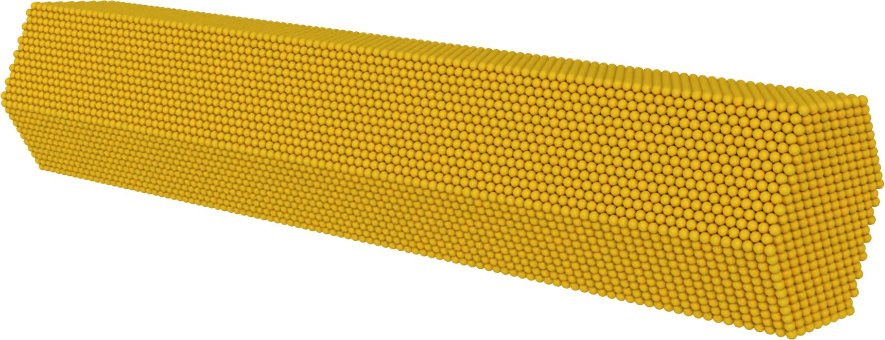

# Milestone 9   Pulling a gold nanowire

## Introduction

In this final milestone, you will run a (parallel) molecular dynamics simulation of the mechanical deformation of a gold nanowire (or whisker). You will compute stress-strain curves and investigate the defects that carry plastic deformation. This milestone is inspired by a [2012 scientific publication](http://dx.doi.org/10.1016/j.actamat.2012.03.018) on twinning-mediated plastic deformation in Au nanowhiskers. You will want to carry out these calculation on a high-performance computing (HPC) system. As a student at Freiburg, you have access to [bwUnicluster](../_notes/bwUnicluster.md).

## Preparation

We provide whiskers of two sizes for you: [whisker_small.xyz](whisker_small.xyz), [whisker_large.xyz](whisker_large.xyz). Start with the smaller one but move to the larger one at a later stage. We also provide a Python script for making these whisker: [make_whisker.py](make_whisker.py). The script require the [Atomic Simulation Environment (ASE)](https://wiki.fysik.dtu.dk/ase/) that can be install via `pip install ase`.

## Stress-strain curves

Stretch the whisker and plot the stress as a function of strain. Use periodic boundary conditions along the whisker. Stretching can then be implemented by changing the periodic size in that direction. The `Domain` class implements the method `scale` that changes the size of the domain and rescales all atoms in that process. Use `scale` to continuously change the system size during your simulation. You will also need to implement computation of the stress for this milestone. Think about how you would compute the total force on the whisker from these periodic calculations. (Hint: This involves evaluating the forces on some ghost atoms.)

## Visualization

Inspect defect formation with OVITO and try to figure out what happens. Correlate the occurrence of defect with features in the stress-strain curves. In OVITO, you can visualize defects in the crystal lattice using the [Common Neighbor Analysis (CNA)](https://www.ovito.org/docs/current/reference/pipelines/modifiers/common_neighbor_analysis.html#particles-modifiers-common-neighbor-analysis). Alternatively, you can try to extract the primary carriers of plastic deformations in crystals, the [dislocations](https://en.wikipedia.org/wiki/Dislocation), using the [Dislocation analysis (DXA)](https://www.ovito.org/docs/current/reference/pipelines/modifiers/dislocation_analysis.html).

## Size, temperature and strain rate

Vary whisker size, temperature and strain rate and repeat the calculations. Plot stress-strain curves for different strain rates at the same temperature and for different temperatures at the same strain rate.

## Task Summary

This milestone requires the following tasks:

* Implement continuous deformation and stress calculation into your code
* Carry out deformation of whiskers of varying sizes at varying temperature and strain rate

We ask you to provide and discuss the following figures in your final report:

* Stress-strain curves
* Visualization of defects

We provide the following files for you:

* [whisker_small.xyz](whisker_small.xyz)
* [whisker_large.xyz](whisker_large.xyz)
* [make_whisker.py](make_whisker.py)
